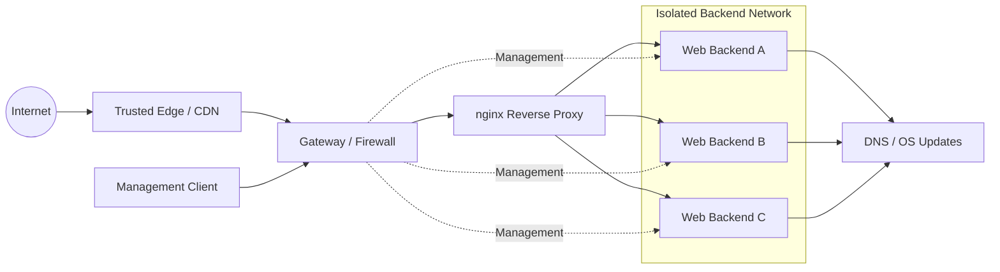

# Secure Self-Hosted Infrastructure

A documented personal infrastructure project based on a real self-hosted Linux environment.

The project focuses on designing, operating and incrementally hardening a small server infrastructure with explicit network trust boundaries, controlled service exposure and reproducible validation after changes.

The published configuration is intentionally sanitized. Domains, addresses, credentials and other operational details have been replaced with generic examples.

## Project scope

I designed, implemented and operate the infrastructure documented in this repository.

Key areas include:

- Linux server administration
- TCP/IP networking and routing
- Network segmentation and access control
- nginx reverse proxy operation
- Default-deny firewall policies
- TLS certificate management
- DNS and controlled outbound connectivity
- Fail2Ban and service hardening
- Logging and monitoring
- Troubleshooting and validation after infrastructure changes
- Technical documentation of architecture and security decisions

## Technologies

Linux · nginx · TCP/IP · Routing · UFW · systemd · Fail2Ban · Let's Encrypt / Certbot · DNS · HTTP/HTTPS · Bash · curl

## Current design



The reverse proxy is the only system allowed to reach the backend web services directly. Administrative access follows explicitly defined management paths instead of unrestricted routing between client and server networks.

Backend systems can establish controlled outbound connections for operating-system updates and DNS without becoming reachable from the public internet.

### Intended communication paths

| Source | Destination | Status | Purpose |
|---|---|---|---|
| Internet | Reverse proxy | Allowed | Public HTTP/HTTPS |
| Internet | Backend systems | Blocked | No direct exposure |
| Reverse proxy | Backend HTTP | Allowed | Application traffic |
| Client network | Backend systems | Blocked | Network isolation |
| Backend | Backend | Blocked | Limit lateral communication |
| Management path | Backend systems | Allowed | Administration |
| Backend | DNS / Internet | Restricted | Updates and maintenance |

## What this project focuses on

- Single public web entry point via nginx
- Backend systems separated from client and public networks
- Default-deny inbound firewall policies
- Backend HTTP reachable only from the reverse proxy
- Explicit administrative access paths
- Controlled outbound connectivity for maintenance and updates
- TLS termination and certificate management via Let's Encrypt / Certbot
- Catch-all rejection of unknown hostnames
- Trusted client-address restoration when a known edge/CDN is used
- Central security headers and request filtering
- Domain-specific logging
- Fail2Ban examples for SSH and suspicious web traffic
- Validation of the complete request path after infrastructure changes

## Architecture evolution

The project started as a conventional reverse-proxy setup with backends on a shared internal network. It has since moved toward stronger segmentation:

1. Backend systems were moved into a dedicated internal network.
2. Direct backend exposure was removed and firewall rules were narrowed to the reverse proxy.
3. Administrative access was separated from normal client-to-server routing.
4. Network isolation was introduced between client and backend networks.
5. Backend outbound routing and DNS were added specifically for maintenance tasks such as `apt update` and `apt upgrade`.
6. The resulting design was verified from the backend, proxy and public edge perspectives.

This is an incremental hardening process rather than a claim of a perfectly isolated or final architecture. Some transitional components may remain until the network is moved to dedicated VLANs and gateway-managed routing.

## Example infrastructure change

One of the larger changes in this environment was separating the backend systems from the general internal network.

### Initial situation

The reverse proxy and backend systems originally operated within a more conventional shared internal network.

Although the backend services were not directly published to the internet, the internal network boundaries were broader than required.

### Objective

Reduce unnecessary connectivity and explicitly define which systems are allowed to communicate with the backend servers.

Required communication paths:

- Reverse proxy → backend HTTP
- Management network → backend administration
- Backend → DNS
- Backend → internet for operating-system updates

All other direct paths should remain blocked unless explicitly required.

### Implementation

The change included:

1. Moving backend systems into a dedicated network segment.
2. Restricting inbound backend access to explicitly required sources.
3. Allowing application traffic only from the reverse proxy.
4. Separating administrative access from ordinary client routing.
5. Adding controlled outbound routing for DNS and system updates.
6. Updating firewall rules to reflect the new trust boundaries.

### Validation

The infrastructure was tested from multiple perspectives after the change.

Examples:

```bash
# Backend network state
ip route
resolvectl status
sudo ufw status verbose

# Reverse proxy
sudo nginx -t
sudo systemctl --failed
sudo fail2ban-client ping

# Proxy to backend
curl -I -H "Host: example.com" http://backend.example.internal

# Public path
curl -I https://example.com
```

Both permitted and intentionally blocked communication paths were verified.

### Result

The public services remained reachable through the reverse proxy while direct access to the backend systems was reduced to explicitly defined operational paths.

The change improved network separation without removing the connectivity required for administration, DNS resolution and operating-system maintenance.

## Security model

### Network level

- Default deny for inbound connections
- Public web traffic terminates at the reverse proxy
- Backend web ports accept traffic only from the proxy
- Client and backend networks are isolated
- Management access uses explicitly defined paths
- Outbound backend access is allowed where required for maintenance

### Reverse proxy level

- Unknown hosts are rejected by dedicated default servers
- HTTP is redirected to HTTPS for known sites
- Security headers are applied centrally where they are application-safe
- Content Security Policy is configured per application rather than globally
- Common probe and leak paths are blocked before backend routing
- Per-domain access and error logs are maintained
- Forwarded client addresses are trusted only from explicitly configured edge networks

### Backend level

- Application servers are not publicly exposed
- Backends serve only the application content required by the proxy
- Administrative interfaces are not published to the internet
- Operating-system updates remain possible through controlled outbound routing

### Reactive controls

- Fail2Ban monitors SSH activity with a normal local jail example
- Example nginx jails are included for repeated suspicious requests
- Web jails are disabled by default until the ban action has been matched to the actual ingress path
- When traffic arrives through a CDN/edge, provider-side blocking may be required because a local firewall only sees the edge connection

## Validation approach

Changes are considered complete only after the relevant layers have been tested.

Typical checks include:

```bash
# Backend network state
ip route
resolvectl status
sudo ufw status verbose

# Reverse proxy
sudo nginx -t
sudo systemctl --failed
sudo fail2ban-client ping

# Proxy to backend
curl -I -H "Host: example.com" http://backend.example.internal

# Public path
curl -I https://example.com
```

Expected behavior:

```text
Public client → edge → reverse proxy → backend     allowed
Reverse proxy → backend HTTP                       allowed
Client network → backend directly                  blocked
Backend → another backend HTTP                     blocked
Backend → internet for updates/DNS                 allowed
Internet → backend directly                        blocked
Unknown hostname → reverse proxy                   rejected
```

## Repository structure

```text
.
├── docs/                         Architecture, networking and security notes
├── nginx/
│   ├── default-deny.conf         Catch-all HTTP/HTTPS rejection
│   ├── http-context-example.conf Logging and trusted real-IP example
│   ├── reverse-proxy-example.conf
│   └── snippets/                 Shared request filtering and safe headers
├── fail2ban/                     Example jails and filters
└── scripts/                      Operational helper scripts
```

## Documentation

- [Architecture](docs/architecture.md)
- [Networking](docs/networking.md)
- [Security model](docs/security-model.md)
- [Monitoring and logging](docs/monitoring-logging.md)
- [TLS and Certbot](docs/tls-certbot.md)
- [nginx deployment notes](docs/nginx-deployment.md)

## Usage

This repository is a reference and starting point, not a drop-in production configuration.

The nginx vHost example targets nginx 1.25.1+ and uses the current `http2 on;` directive.

Before applying any example:

1. Replace placeholder domains, addresses and networks.
2. Adapt firewall rules to the real trust boundaries.
3. Install the catch-all default servers and remove conflicting distribution defaults.
4. Define the `main` log format in the nginx `http {}` context.
5. If a trusted edge/CDN is used, replace the documentation-only real-IP ranges and header with the provider's current values. Never trust forwarded client-IP headers from arbitrary sources.
6. Confirm that management access remains available before applying network changes.
7. Validate nginx with `nginx -t`.
8. Test certificate renewal with `certbot renew --dry-run`.
9. Verify both allowed and intentionally blocked traffic paths.
10. Enable web-facing Fail2Ban jails only after testing a ban action that is effective for the actual ingress path.

## Current direction

The present design uses a dedicated backend segment and explicit management paths. The next logical step is moving the transitional routing components to native VLANs and gateway-managed firewall rules while keeping the same security boundaries.

The goal is not maximum complexity. The goal is a small, understandable infrastructure where every allowed path has a reason to exist.

## License

MIT
